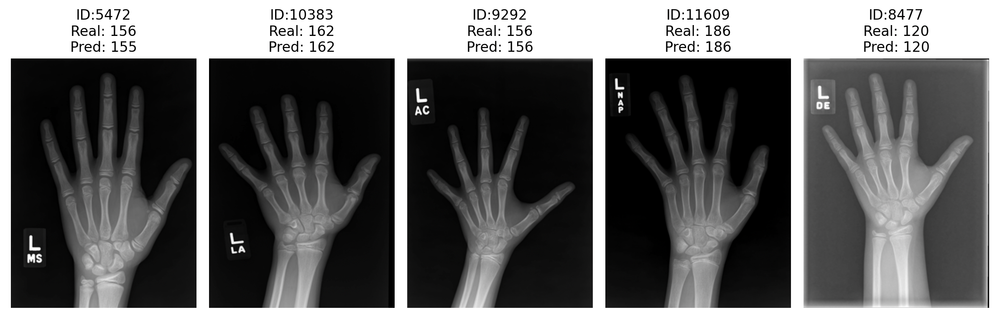

# Bone Age Prediction

**BoneAgeNet**.

This project aims to automate bone age estimation using a deep learning model trained on thousands of pediatric hand X-ray images.
Our goal is to support radiologists and clinical decision-making by providing fast, accurate, and reliable predictions of skeletal maturity.
The model applies modern computer vision techniques to streamline what is traditionally a time-consuming and subjective process.

## Important Links

| [Timesheet](https://1sfu-my.sharepoint.com/:x:/r/personal/hamarneh_sfu_ca/Documents/TEACHING/CMPT419_SPRING2025/FOR_STUDENTS/ProjectGroup_Timesheets/Group_18_Timesheet.xlsx?d=wf2c1ca97e6c241e6af17aef95c6c469a&csf=1&web=1&e=8ExCo4) | [Slack channel](https://cmpt419spring2025.slack.com/archives/C086FBDGTBN) | [Project report](https://www.overleaf.com/4827965591fvcxmcvvnhsy#893308) |
|-----------|---------------|-------------------------|


- Timesheet: A shared Excel sheet to track each member's the time and tasks completed/participated for this project.
- Slack channel: Our private Slack project channel.
- Project report: Our Overleaf project report document.


## Video/demo/GIF
🎬 [Watch the Presentation Video](https://www.youtube.com/watch?v=qUDguB83JRQ)


## Table of Contents
1. [Demo](#demo)

2. [Installation / Reproduction](#installation)

3. [Dependencies](#dependencies)

4. [Guidance](#guide)


<a name="demo"></a>
## 1. Example demo

This mini example demo shows the output of 5 x-ray images with best prediction.
Screenshot below shows the plot.

```python
import pandas as pd
import matplotlib.pyplot as plt
from PIL import Image
from pathlib import Path

image_dir = Path("../data/processed/training-set")
labels = pd.read_csv("../submission.csv")
labels["error"] = abs(labels["real"] - labels["prediction"])

df_sorted = labels.sort_values(by="error", ascending=False)

fig, axes = plt.subplots(1, 5, figsize=(12, 4))
    
# Show top 5 best predictions
for idx, row in enumerate(df_sorted.tail(5).itertuples()):
	img_path = image_dir / f"{int(row.id)}.png"
	image = Image.open(img_path).convert("L")

	axes[idx].imshow(image, cmap='gray')
	axes[idx].axis("off")
	axes[idx].set_title(f"ID:{row.id}\nReal: {int(row.real)}\nPred: {int(row.prediction)}")

plt.suptitle("Top 5 Best Predictions", y=1.05)
plt.tight_layout()
plt.show()
plt.close(fig)
```
Output of the results:


### What to find where

This is how project acrhitecture should look like after:
1) data is downloaded and inserted
2) dependencies are installed in /venv

```bash
repository/
├── src/
│   ├── amazing/
│   │   └── amazingexample.py          # Demo and orchestration functions
│   ├── data/
│   │   ├── boneage-test-dataset/      # Test data images and CSV
│   │   ├── boneage-training-dataset/  # Training data images and CSV
│   ├── helpers/
│   │   └── utils.py                   # Utility functions (helpers)
│   ├── preprocessing/
│   │   ├── preprocessing.py           # Data preprocessing scripts
│   │   ├── preprocessing-sample.ipynb # Pre-processing test
│   │   └── preprocessing.ipynb        # Data preprocessing notebook
│   ├── model-building.ipynb           # Model training and evaluation for bone age prediction
│   ├── gender_classification.ipynb    # Model training for bone gender prediction
│   ├── statistical-analysis.ipynb     # Analysis and visualization of model outputs
│   ├── run.py                         # Main script to run project workflow
│   ├── submission.csv                 # Output from model predictions
│   └── results.csv                    # Additional result logs and metrics
├── venv/                              # Python virtual environment directory
├── LICENSE
├── README.md
├── requirements.txt                   # Dependencies list
├── introduction.txt                   # Project overview and notes
└── .gitignore                         # Git ignore rules for unwanted files
```

<a name="installation"></a>

## 2. Installation / Reproduction
Cloning and Dependencies Installation
```bash
# Clone the repository (choose HTTPS or SSH)
git clone https://github.com/sfu-cmpt419/2025_1_project_18.git
# or
git git@github.com:sfu-cmpt419/2025_1_project_18.git
cd 2025_1_project_18

# Create a virtual environment and install dependencies
python3.12 -m venv venv # python 3.12 must be used 
source venv/bin/activate #(on MAC)
pip install -r requirements.txt
```

Getting Data:
Original Data is too large and it takes a lot of time for pre-processing. So we provided already processed data that is only 300 MB in size. The .zip file also contains the csv file with training labels. Download data on the following link:
https://drive.google.com/file/d/1A-cas09uyZFP2XduVxvxr9A-7-ymrFlg/view?usp=sharing

After you download the data, unzip the folder and paste it in /src folder from repository. Please double-check previous section on Project Architecture to make sure data and other files are organized as shown there. 

Reproduction
```bash

cd src
python3 model-building.py           # MAIN model
python3 gender_classification.py    # model for a side project
python3 statistical-analysis.py     # script for statistical analysis

```
The model training produces a submission.csv in the source folder.
Generated plots and statistical outputs are saved as specified in the respective notebooks/scripts.


<a name="dependencies"></a>
## 3. Dependencies

This project uses the following libraries:
- PyTorch
- Seaborn
- Pandas
- NumPy
- matplotlib
- sci-kit learn
- pathlib
- PIL

<a name="guide"></a>
## 4. Guidance

- Use [git](https://git-scm.com/book/en/v2)
    - Do NOT use history re-editing (rebase)
    - Commit messages should be informative:
        - No: 'this should fix it', 'bump' commit messages
        - Yes: 'Resolve invalid API call in updating X'
    - Do NOT include IDE folders (.idea), or hidden files. Update your .gitignore where needed.
    - Do NOT use the repository to upload data
- Use [VSCode](https://code.visualstudio.com/) or a similarly powerful IDE
- Use [Copilot for free](https://dev.to/twizelissa/how-to-enable-github-copilot-for-free-as-student-4kal)
- Sign up for [GitHub Education](https://education.github.com/) 
